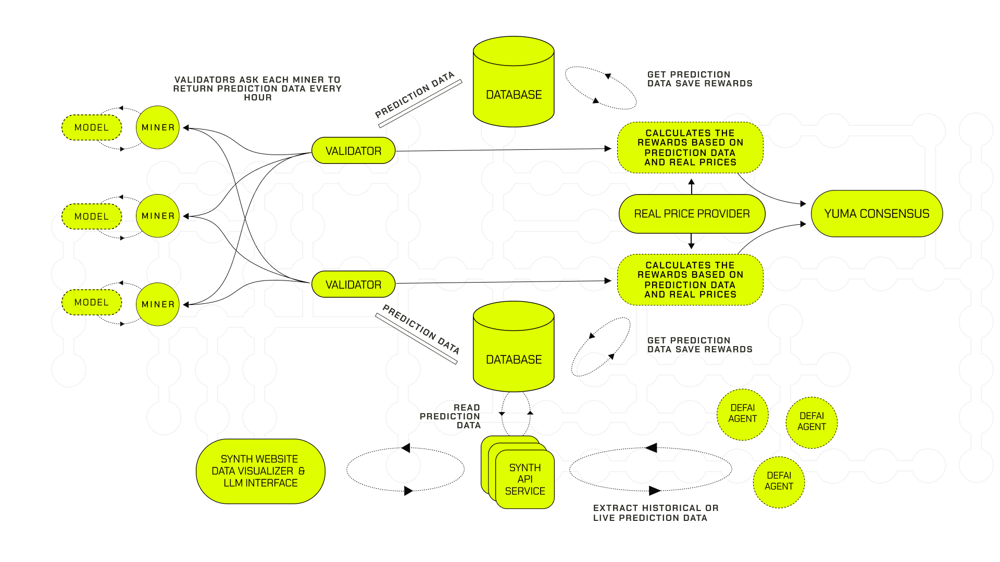
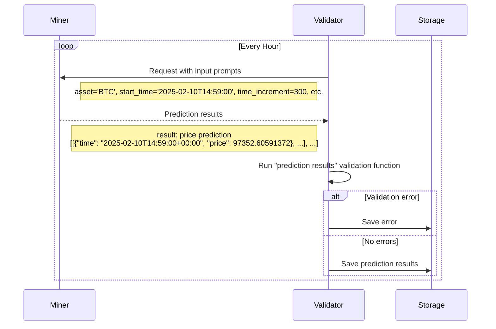
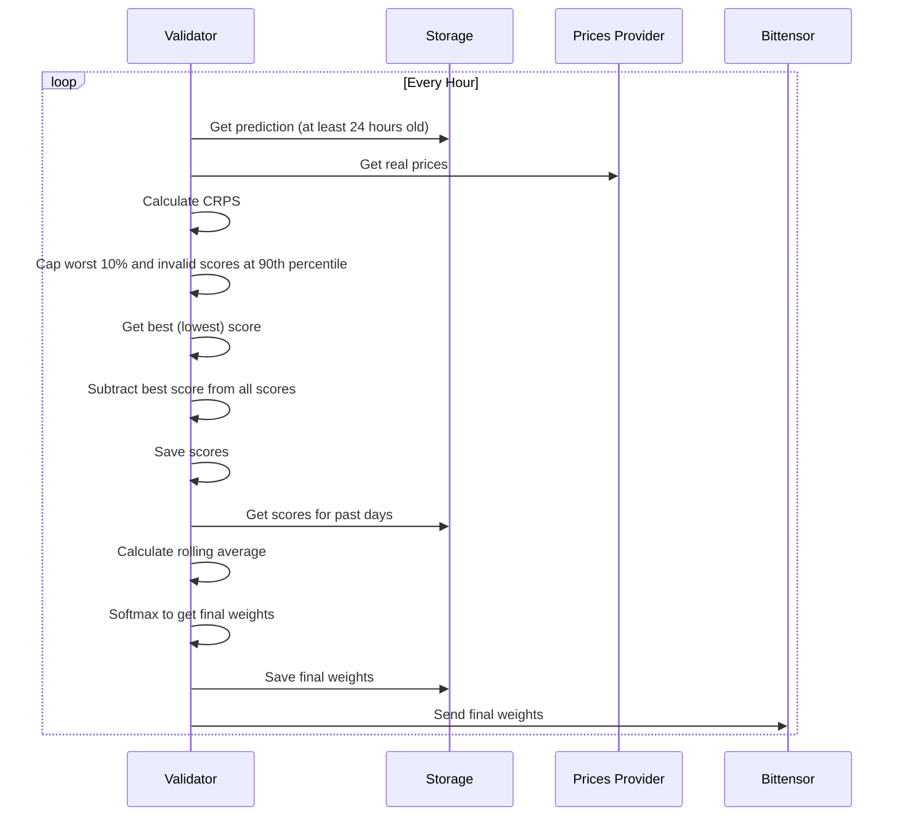

<div align="center">
  <a href="https://www.synthdata.co/">
    
  </a>
</div>

<h1 align="center">
    Synth Subnet
</h1>

<div align="center">
    <a href="https://www.synthdata.co" target="_blank">
        <b>Website</b>
    </a>
·
    <a href="https://github.com/synthdataco/synth-subnet/blob/main/Synth%20Whitepaper%20v1.pdf" target="_blank">
        <b>Whitepaper</b>
    </a>
·
    <a href="https://discord.gg/gnt8sFMdg6" target="_blank">
        <b>Discord</b>
    </a>
·
    <a href="https://api.synthdata.co/docs" target="_blank">
        <b>API Documentation</b>
    </a>
</div>

---

<div align="center">

[][license]

</div>

---

### Table of contents

- [1. Overview](#-1-overview)
  - [1.1. Introduction](#11-introduction)
  - [1.2. Task Presented to the Miners](#12-task-presented-to-the-miners)
  - [1.3. Validator's Scoring Methodology](#13-validators-scoring-methodology)
  - [1.4. Calculation of Leaderboard Score](#14-calculation-of-leaderboard-score)
- [2. Usage](#-2-usage)
  - [Quick Start](#quick-start)
  - [2.1. Miners](#21-miners)
    - [2.1.1. Tutorial](#211-tutorial)
    - [2.1.2. Reference](#212-reference)
  - [2.2. Validators](#22-validators)
  - [2.3. Develop](#23-develop)
- [3. License](#-3-license)

## 🔭 1. Overview

> **TL;DR** — Miners submit ensembles of simulated price paths for a basket of crypto, equity, and commodity assets across two timeframes (`24h` and `1h`). Validators score each ensemble with CRPS on price changes over multiple time increments, take a rolling weighted average within a per-timeframe window (10 days for `24h`, 3 days for `1h`), and allocate emissions via softmax — split 50/50 between the two timeframes. Lower CRPS → more emissions.

### 1.1. Introduction

The Synth Subnet leverages Bittensor’s decentralized intelligence network to create the world's most powerful synthetic data for price forecasting. Unlike traditional price prediction systems that focus on single-point forecasts, Synth specializes in capturing the full distribution of possible price movements and their associated probabilities, to build the most accurate synthetic data in the world.

Miners in the network are tasked with generating multiple simulated price paths, which must accurately reflect real-world price dynamics including volatility clustering and fat-tailed distributions. Their predictions are evaluated using the Continuous Ranked Probability Score (CRPS), which measures both the calibration and sharpness of their forecasts against actual price movements.

Validators score miners on short-term and long-term prediction accuracy, averaging each miner's per-request scores over a short rolling window so that recent performance dominates. Daily emissions are allocated based on miners’ relative performance, creating a competitive environment that rewards consistent accuracy.

<div align="center">
    
</div>

Figure 1.1: Overview of the synth subnet.

The Synth Subnet aims to become a key source of synthetic price data for AI Agents and the go-to resource for options trading and portfolio management, offering valuable insights into price probability distributions.

<sup>[Back to top ^][table-of-contents]</sup>

### 1.2. Task Presented to the Miners



Miners are tasked with providing probabilistic forecasts of an asset's future price movements. Specifically, each miner is required to generate multiple simulated price paths for an asset, from the current time over specified time increments and time horizon. The network currently runs two competitions distinguished by their forecast timeframe — `24h` and `1h` HFT — and the supported assets on each are listed in the parameter sections below.

The asset set has grown over time:

| Date       | Change                                                                                              |
| ---------- | --------------------------------------------------------------------------------------------------- |
| Launch     | BTC only on the `24h` competition. 100 simulated paths, 5-minute increments.                        |
| 2025-11-13 | Bumped to 1000 paths; added ETH, SOL, XAU to the `24h` competition. Synth begins moving toward HFT. |
| 2026-01    | Added tokenized equities SPYX, NVDAX, TSLAX, AAPLX, GOOGLX to the `24h` competition.                |
| 2026-03    | Added XRP, HYPE, WTIOIL to the `24h` competition; added HYPE to the `1h` competition.               |

Whereas other subnets ask miners to predict single values for future prices, we’re interested in the miners correctly quantifying uncertainty. We want their price paths to represent their view of the probability distribution of the future price, and we want their paths to encapsulate realistic price dynamics, such as volatility clustering and skewed fat tailed price change distributions. As the network matures, modelling the correlations between asset prices will be essential.

If the miners do a good job, the Synth Subnet will become the world-leading source of realistic synthetic price data for training AI agents. And it will be the go-to location for asking questions on future price probability distributions - a valuable resource for options trading and portfolio management.

The checking prompts sent to the miners will have the format:
(start_time, asset, time_increment, time_horizon, num_simulations)

The two competitions differ on the parameters below:

| Parameter                      | `24h` competition                                                        | `1h` HFT competition     |
| ------------------------------ | ------------------------------------------------------------------------ | ------------------------ |
| Emissions share                | 50%                                                                      | 50%                      |
| Cycle period (all assets)      | ~60 min                                                                  | ~10 min                  |
| Start time ($t_0$)             | +1 min from request                                                      | +1 min from request      |
| Time increment ($\Delta t$)    | 5 min                                                                    | 1 min                    |
| Time horizon ($T$)             | 24 h                                                                     | 1 h                      |
| Simulations ($N_{\text{sim}}$) | 1000                                                                     | 1000                     |
| Assets                         | BTC, ETH, XAU, SOL, SPYX, NVDAX, TSLAX, AAPLX, GOOGLX, XRP, HYPE, WTIOIL | BTC, ETH, SOL, XAU, HYPE |
| Rolling-average window         | 10 days                                                                  | 3 days                   |
| Softmax temperature ($\beta$)  | 0.1                                                                      | 0.2 (sharper allocation) |

**Asset Weights**

| Asset  | Weight             | Competitions |
| ------ | ------------------ | ------------ |
| BTC    | 1.0                | `24h`, `1h`  |
| ETH    | 0.7064366394033871 | `24h`, `1h`  |
| XAU    | 1.7370922597118699 | `24h`, `1h`  |
| SOL    | 0.6310037175639559 | `24h`, `1h`  |
| SPYX   | 3.437935601155441  | `24h`        |
| NVDAX  | 1.6028217601617174 | `24h`        |
| TSLAX  | 1.6068755936957768 | `24h`        |
| AAPLX  | 2.0916380815843123 | `24h`        |
| GOOGLX | 1.6827392777257926 | `24h`        |
| XRP    | 0.5658394110809131 | `24h`        |
| HYPE   | 0.4784547133706857 | `24h`, `1h`  |
| WTIOIL | 0.8475062847978935 | `24h`        |

Validators cycle through the assets, sending out prediction requests at regular intervals. The miner has until the start time to return ($N_{\text{sim}}$) paths, each containing price predictions at times given by:

$$
t_i = t_0 + i \times \Delta t, \quad \text{for }\, i = 0, 1, 2, \dots, N
$$

where:

- $N = \dfrac{T}{\Delta t}$ is the total number of increments.

We recommend the miner sends a request to the Pyth Oracle to acquire the price of the asset at the start_time.

If they fail to return predictions by the start_time or the predictions are in the wrong format, the submission is marked invalid and assigned the 90th-percentile score during the per-prompt CRPS transformation (see [§1.4](#14-calculation-of-leaderboard-score)).

<sup>[Back to top ^][table-of-contents]</sup>

### 1.3. Validator's Scoring Methodology

The role of the validators is, after the time horizon has passed, to judge the accuracy of each miner’s predicted paths compared to how the price moved in reality. The validator evaluates the miners' probabilistic forecasts using the Continuous Ranked Probability Score (CRPS). The CRPS is a proper scoring rule that measures the accuracy of probabilistic forecasts for continuous variables, considering both the calibration and sharpness of the predicted distribution. The lower the CRPS, the better the forecasted distribution predicted the observed value.

#### Application of CRPS to Ensemble Forecasts

In our setup, miners produce ensemble forecasts by generating a finite number of simulated price paths rather than providing an explicit continuous distribution. The CRPS can be calculated directly from these ensemble forecasts using an empirical formula suitable for finite samples.

For a single observation $x$ and an ensemble forecast consisting of $N$ members $y_1, y_2, \dots, y_N$, the CRPS is calculated as:

$$
\text{CRPS} = \frac{1}{N}\sum_{n=1}^N \left| y_n - x \right| - \frac{1}{2N^2} \sum_{n=1}^N \sum_{m=1}^N \left| y_n - y_m \right|
$$

where:

- The first term $\dfrac{1}{N}\sum_{n=1}^N \left| y_n - x \right|$ measures the average absolute difference between the ensemble members and the observation $x$.
- The second term $\dfrac{1}{2N^2} \sum_{n=1}^N \sum_{m=1}^N \left| y_n - y_m \right|$ accounts for the spread within the ensemble, ensuring the score reflects the ensemble's uncertainty.

This formulation allows us to assess the miners' forecasts directly from their simulated paths without the need to construct an explicit probability distribution.

The CRPS values are calculated on the price change in basis points for each interval. This allows the prompt scores to have the same 'units' for all assets, and hence for the smoothed score to be calculated using an EMA over all prompts, irrespective of which asset the prompt corresponds to.

#### Application to Multiple Time Increments

To comprehensively assess the miners' forecasts, the CRPS is applied to sets of price changes in basis points over different time increments. The exact intervals depend on the prompt type:

- **`24h` prompts**: 5 minutes, 30 minutes, 3 hours, 24 hours.
- **`1h` HFT prompts**: 1, 2, 5, 15, 30, and 60 minutes, plus a "gaps from start" series measured at every 5-minute offset between 5 and 60 minutes (i.e. price change from $t_0$ to $t_0 + 5\text{min}$, $t_0 + 10\text{min}$, …, $t_0 + 60\text{min}$).

For each time increment:

- **Predicted Price Changes**: The miners' ensemble forecasts are used to compute predicted price changes in basis points over the specified intervals
- **Observed Price Changes**: The real asset prices are used to calculate the observed price changes in basis points over the same intervals. We recommend the validators collect and store the prices by sending requests to the Pyth oracle at each time increment, to be used at the end of the time horizon.
- **CRPS Calculation**: The CRPS is calculated for each increment by comparing the ensemble of predicted changes in basis points to the observed price change.

The final score for a miner for a single checking prompt is the sum of these CRPS values over all the time increments.

<sup>[Back to top ^][table-of-contents]</sup>

### 1.4. Calculation of Leaderboard Score



#### CRPS Transformation

After calculating the sum of the CRPS values, the validator transforms the resulting scores in the following way:

- Compute the 90th percentile of the CRPS sums across miners who submitted valid predictions;
- Cap each submitted CRPS sum at that 90th percentile (so the worst 10% are pulled in to the 90th percentile value);
- For miners that failed to submit predictions in time or in the correct format, assign the 90th percentile score;
- Get the best (=lowest) CRPS sum from the resulting set;
- Subtract that best score from every miner's score, so the best miner ends with a score of 0.

#### Rolling Average (Leaderboard Score)

The validator is required to store the historic request scores (as calculated in the previous step) for each miner. After each new request is scored, the validator recalculates the ‘leaderboard score’ for each miner, using a rolling average over their past **per-request** scores within a per-timeframe window (10 days for the `24h` competition, 3 days for the `1h` HFT competition), weighted by asset-specific weights. The `1h` competition runs ~6× more cycles per day than `24h` (every ~10 min vs every ~60 min), so it accumulates per-miner samples much faster — hence the shorter window.

This approach emphasizes recent performance while still accounting for historical scores.
The leaderboard score for miner $i$ at time $t$ is calculated as:

$$
L_i(t) = \frac{\sum_{j} S_{i,j} w_{k,j}}{\sum_{j} w_{k,j}}
$$

where:

- $S_{i,j}$ is the score of miner $i$ at request $j$.
- $w_{k,j}$ is the weight given to asset $k$ scored at request $j$.
- The sum runs over all requests $j$ such that $t - t_j \leq T$, where $T$ is the per-timeframe rolling window size (10 days for `24h`, 3 days for `1h`).

Thus, highest-ranking miners are those with the lowest calculated scores.

#### Final Emissions

Once the leaderboard scores have been calculated, the emission allocation for miner $i$ is given as:

$$
A_i(t) = \frac{e^{-\beta \cdot L_i(t)}}{\sum_j e^{-\beta \cdot L_j(t)}} \cdot E(t)
$$

where:

- $L_i(t)$ is in basis points (inherited from the CRPS units in §1.3).
- $\beta$ is a per-competition softmax temperature: `0.1` for the `24h` competition and `0.2` for the `1h` HFT competition (so the `1h` competition allocates emissions more sharply across miners).
- $E(t)$ is the total emission at time $t$.

The two competitions are scored independently. Their softmax weights are then each scaled by 50% (the emissions split shown in §1.2) and summed for miners that placed on both.

<sup>[Back to top ^][table-of-contents]</sup>

## 🪄 2. Usage

### Quick Start

The fastest way to validate your environment and the reference miner locally:

```shell
git clone https://github.com/synthdataco/synth-subnet.git
cd synth-subnet
python -m venv venv && source venv/bin/activate
pip install -r requirements.txt
python synth/miner/run.py   # prints "CORRECT" if the dummy model's output format is valid
```

From there, follow the [miner tutorial](./docs/miner_tutorial.md) to plug in your own model, register a Bittensor wallet, and launch the miner under PM2. Validators should jump straight to the [validator guide](./docs/validator_guide.md).

<sup>[Back to top ^][table-of-contents]</sup>

### 2.1. Miners

#### 2.1.1. Tutorial

Please refer to this miner [tutorial](./docs/miner_tutorial.md) for detailed instructions on getting a miner up and running.

<sup>[Back to top ^][table-of-contents]</sup>

#### 2.1.2. Reference

Once you have your miner set up, you can check out the miner [reference](./docs/miner_reference.md).

> 💡 **TIP:** Are you having issues? Check out the [FAQs](./docs/miner_reference.md#21-faqs) section of the miner [reference](./docs/miner_reference.md).

<sup>[Back to top ^][table-of-contents]</sup>

### 2.2. Validators

Please refer to this [guide](./docs/validator_guide.md) for more detailed instructions on getting a validator up and running.

<sup>[Back to top ^][table-of-contents]</sup>

### 2.3 Develop

```shell
pip install -r requirements-dev.txt
pre-commit install
```

<sup>[Back to top ^][table-of-contents]</sup>

## 📄 3. License

Please refer to the [LICENSE][license] file.

<sup>[Back to top ^][table-of-contents]</sup>

<!-- links -->

[license]: https://github.com/synthdataco/synth-subnet/blob/main/LICENSE
[table-of-contents]: #table-of-contents
